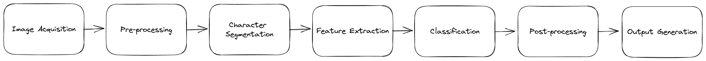

# 🧠 How it Works

At a high-level, a traditional OCR process can be broken down into the following steps:

1.) <b>Image acquisition:</b> Capture the image containing the text - usually via scanner, camera, or other image-capturing device.

2.) <b>Pre-processing:</b> Process the image to enhance its quality. This may involve operations like noise reduction, binarization (converting the image to black and white), and deskewing (aligning the text horizontally or vertically).

3.) <b>Character segmentation:</b> Identify and isolate individual characters from the image. This can be challenging, especially when characters are connected or overlapping.

4.) <b>Feature extraction:</b> Extract various features of the segmented characters to represent their unique characteristics. These features could include stroke thickness, shape, and other relevant properties.

5.) <b>Classification:</b> Classify each character using extracted features and compare them to a pre-existing database of known characters. Machine learning algorithms, such as neural networks or statistical models, are often employed for this task.

6.) <b>Post-processing:</b> Refine and process classified characters to correct any errors or inconsistencies. This may involve applying linguistic rules, context analysis, or spell-checking algorithms to improve accuracy.

7.) <b>Output generation:</b> Convert recognized characters into machine-readable text, which can be further processed or utilized in various applications.

There are additional application-specific optimizations that are often introduced. For example, if the OCR system is designed to recognize a specific font, then the character segmentation step can be skipped. Similarly, if the OCR system is designed to recognize a specific language, then the classification step can be simplified.